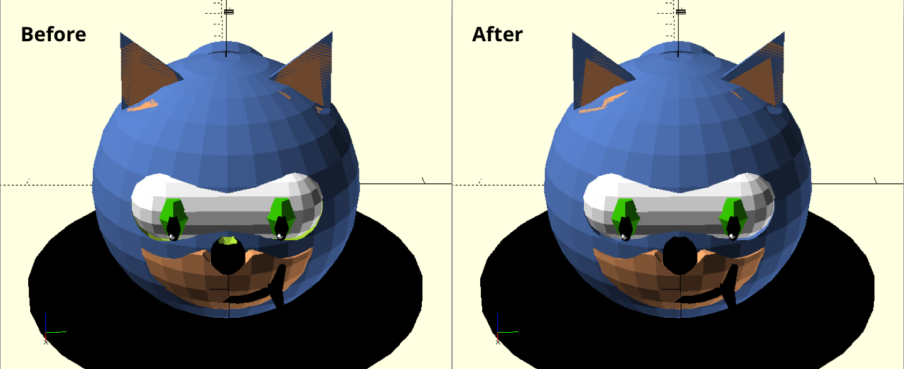

# 1. Refactoring mechanics in OpenSCAD

This exercise consists in refactor an OpenSCAD proyect from an IDE without concessions where mechanics are really important. The key goal here is to learn the basic skills for refactoring. During the refactor we will use the rendered view as a visual test to check at each moment that nothing is modified during the manipulation of the code base.

## Objectives

In this specific case the key objective is to remove as much code smells as possible, improve the structure of the code and make it more semantic and remove unnecesary comments and lines.

## Resources

To realize this refactor we are going to make use of the following techniques:

- Extract method and global variables
- Inline method
- Replace temporal variables with functions
- Introduce explaining variables and replace values with them
- Split temporary variables
- Replace magic numbers with symbolic constants
- Decompose conditionals
- Highlight constants using uppercase
- Avoid overqualification in variable and method names
- Focus on small parts
- Modify only a specific code block at every moment
- Decompose big chunks of code into small parts

## Reference

The code from the [OpenSCAD-Sonic](https://github.com/husmum/OpenSCAD-Sonic) GitHub repo will be used as code base for this refactor. To prevent the loose of this reference, the source code has been copied to the `/reference` folder relative to this file.

## Result

The `/exercise` folder contains the result of this exercise.

After make the refactor the code seems easier to understand and manipulate. Also due to the descomposition and division of the components it is easier to access and know which lines of code affects each part of the composition. These are the changes made:

- Extract each component into its own file
- Rename main file to `sonic.scad`, the suffix design is irrelevant here.
- Clean code globally
  - Replace base module name by pedestal
  - Fix green color in substractions
  - Create fuction `array_range` to iterate over an array lenght range
  - Unify indentation and spaces
  - Remove unnecesary curly braces
  - Removed some unnecesary variables
- Refactor code for ears
  - Extract inner_ear, outer_ear, ear and ears to its own modules
  - Remove unnecesary code
  - Replace magic numbers with variables to improve code comprehension
- Refactor snout and smirk code
  - Use variables to avoid magic numbers
  - Remove unnecesary code
  - Unify similar behaviours
  - Extract snout and smirk to its own module
- Refactorized the code for nose
  - Reindent code to improve readability
  - Extract the code for nose to its own module
  - Divide nose parts into different modules to improve code comprehension
  - Use BLACK constant for the color
  - Replace magic numbers by variables
- Refactor hair logic
- Refactor eyes logic and modularize its parts
- Refactor head and extract it to its own method
- Extract base to its own module
  - Extract black color query to its own constant
  - Introduce explaining variables for offset and dimensions

Also during the refactor, some bugs has been fixed to improve the quality of the design. This bugs are related to the substracted parts. Due that they didn't come with a specific color by default they left a green surface. The following picture shows how the new design differs from the previous result:

